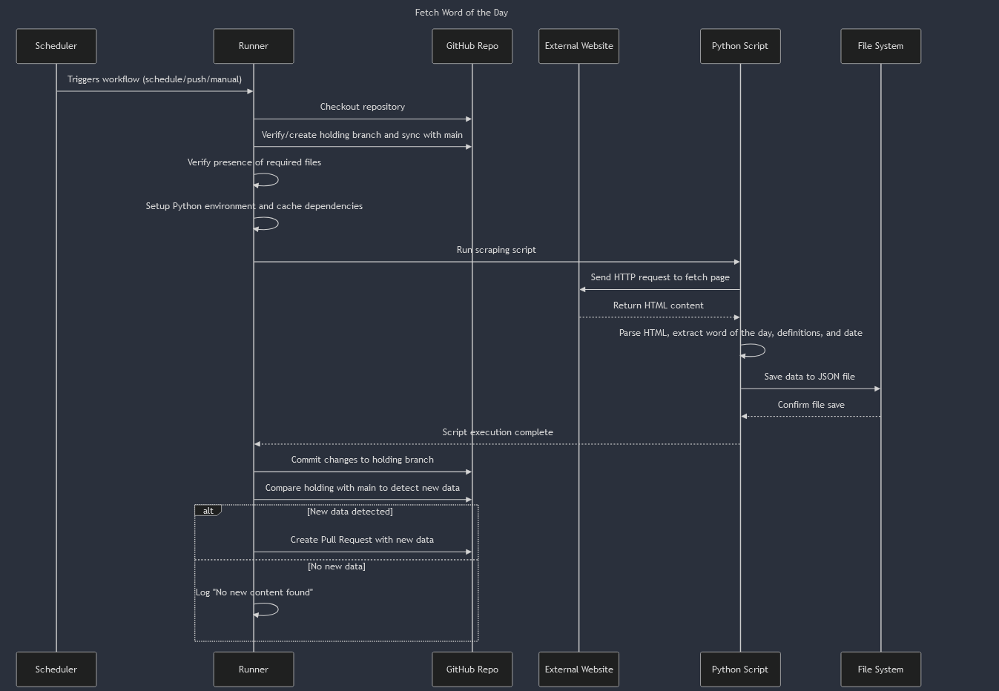

# WordHunt
**WordHunt:** Discover a new word, every single day!

WordHunt scrapes a French dictionary website to bring you a daily word along with its definitions. The project automates the process of fetching, parsing, and storing word data so that you can explore new vocabulary effortlessly.

## Data Source
- **Primary Source:** [Dicolink](https://www.dicolink.com/api)  
  Currently, there is no official API available for Dicolink, so WordHunt uses web scraping to retrieve the word of the day.

## Sequence Diagram
The following sequence diagram illustrates the workflow for fetching the word of the day using our automation:



## How It Works
1. **Workflow Trigger:**  
   The process is initiated daily via GitHub Actions (or can be manually triggered), which starts the automated workflow.

2. **Repository Setup:**  
   - The workflow checks out the repository.
   - It ensures that a dedicated `holding` branch exists and is synchronized with the `main` branch.
   - Required files and environment are verified and set up, including installing Python dependencies.

3. **Scraping Process:**  
   - A Python script sends a request to the Dicolink website.
   - It parses the HTML content to extract the word of the day, its definitions, and the corresponding date.
   - The script then saves this data as a JSON file in the `data/` directory.

4. **Data Handling and PR Creation:**  
   - After scraping, the workflow commits any new data to the `holding` branch.
   - It compares the latest data against the `main` branch.  
   - If new data is detected, a Pull Request is automatically created for review and merging.

5. **Outcome:**  
   - Users receive a fresh word of the day.
   - The data is stored and versioned within the repository for future reference.

## Setup & Usage
1. **Clone the Repository:**
   ```bash
   git clone https://github.com/yourusername/WordHunt.git
   cd WordHunt
   ```

2. **Install Dependencies:**
   Ensure you have Python 3.9 or higher installed, then run:
   ```bash
   pip install -r requirements.txt
   ```

3. **Run the Scraping Script:**
   You can manually run the script to fetch the current word of the day:
   ```bash
   python dicolink/dicolink.py
   ```

4. **Automated Workflow:**
   - The GitHub Action workflow is set up to run automatically on a daily schedule.
   - It handles fetching, parsing, and storing new words, as well as creating pull requests when new data is available.

5. **Check the Data:**
   - After the script or workflow runs, check the `data/` directory for JSON files containing the latest word and its definitions.

## Contributing
Contributions are welcome! If you have ideas for improvements or encounter issues, please open an issue or submit a pull request.

## License
This project is licensed under the MIT License.
