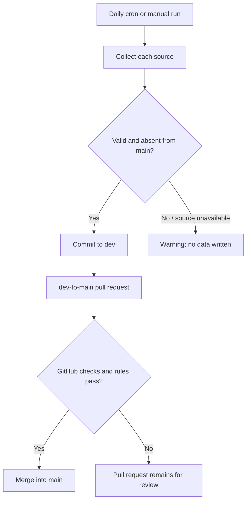

# WordHunt

WordHunt archives several French words of the day with their definitions in
`data/<source>_word_of_the_day_YYYY-MM-DD.json`.

## Sources

| Source | Collection method | Content |
| --- | --- | --- |
| [Dicolink](https://www.dicolink.com/motdujour) | Page parsing | French definitions grouped by dictionary source |
| [FrenchDictionary.com](https://www.frenchdictionary.com/wordoftheday) | Card explicitly labelled `TODAY` | French word, English meaning and an example |
| [Wiktionnaire](https://fr.wiktionary.org/wiki/Wiktionnaire:Mot_du_jour) | MediaWiki API and its curated calendar | French word and definitions from its French entry |

Each collector validates the word, date and non-empty definitions before writing.
A source can fail or not have a published entry that day; the daily job records a
warning and continues with the other sources. It never stores placeholders or
empty data.

## Run locally

```bash
python -m pip install -r requirements.txt
python scripts/fetch_word.py dicolink --output-dir /tmp/wordhunt
python scripts/fetch_word.py frenchdictionary --output-dir /tmp/wordhunt
python scripts/fetch_word.py wiktionary --output-dir /tmp/wordhunt
python -m unittest discover -s tests -v
python scripts/audit_data.py
```

The collectors use bounded HTTP retries and connection/read timeouts. JSON writes
are atomic. A valid record that already exists on the target branch is preserved;
a different valid word for the same source/date stops the run for review.

## Daily publication

The `Daily word collection` workflow runs at **06:20 UTC** and can be started
manually. It fetches each source independently, commits every new validated
record to `dev`, pushes `dev`, then creates or updates the `dev → main` pull
request.


```mermaid
flowchart TD
    A["Daily cron or manual run"] --> B["Collect each source"]
    B --> C{"Valid and absent from main?"}
    C -->|Yes| D["Commit to dev"]
    C -->|No / source unavailable| E["Warning; no data written"]
    D --> F["dev-to-main pull request"]
    F --> G{"GitHub checks and rules pass?"}
    G -->|Yes| H["Merge into main"]
    G -->|No| I["Pull request remains for review"]
```

Each fetched record is compared with `main`, the validated archive. A source that
changes its word later that day is skipped rather than replacing the first valid
record. The workflow also merges the current `main` into `dev` before it publishes
new data, so a daily pull request only contains genuinely new records.

It asks GitHub to auto-merge that pull request once repository rules and checks
allow it. If auto-merge is disabled, the merge request remains open and is updated
by the next daily collection.

Set `PERSONAL_ACCESS_TOKEN` with `contents: write` and `pull-requests: write` if
workflow-generated commits must trigger subsequent workflows. Without it, the
workflow falls back to `GITHUB_TOKEN`; the daily schedule still performs the next
cycle. The repository must allow GitHub Actions to create pull requests and allow
auto-merge if automatic final merging is desired.

CI runs the tests and validates the complete active archive on every relevant
push and pull request. Each active filename must encode its declared source and
ISO publication date.

## Archive correction

The 601 `robert_*` files were removed from the active archive because they stored
a Le Robert suggestion page rather than a daily word. They remain recoverable in
git history, but are not usable dictionary records. Le Robert currently returns
HTTP 403 to automated requests, so it is intentionally not an active collector.
The Dicolink record for 2026-05-15 was repaired by removing its empty definition.

## License

The code is MIT licensed. Dictionary content remains attributable to its source.
